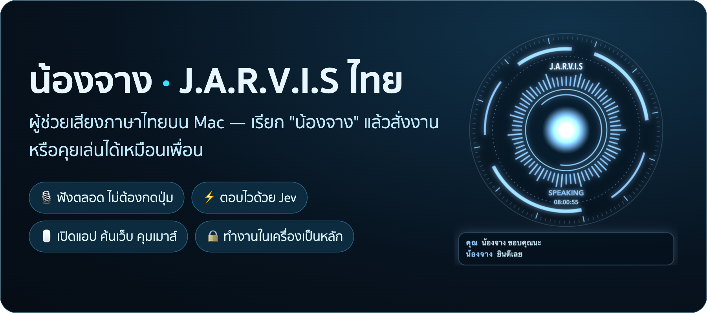
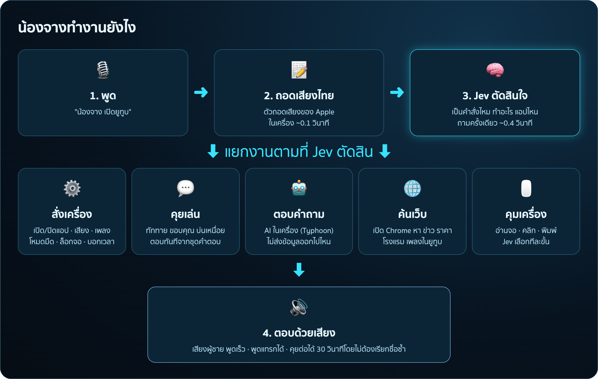
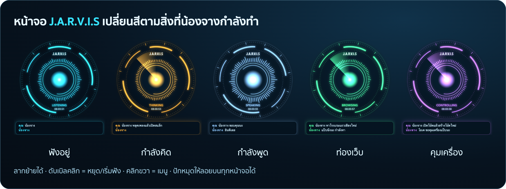

<p align="center">
  
</p>

# น้องจาง — ผู้ช่วยเสียงภาษาไทยบน Mac

น้องจางคือผู้ช่วยแบบ **J.A.R.V.I.S** ในหนัง ที่ฟังภาษาไทยรู้เรื่อง
แค่เรียก **"น้องจาง"** แล้วพูดสิ่งที่อยากให้ทำ — ไม่ต้องกดปุ่ม ไม่ต้องพิมพ์ และคุยต่อได้เหมือนคุยกับเพื่อน

## ลองพูดแบบนี้

| พูดว่า | น้องจางจะ… |
|---|---|
| "น้องจาง เปิดยูทูบ" | เปิด YouTube ใน Chrome ของคุณ |
| "น้องจาง หยุดเพลงแล้วเปิดไลน์" | ทำสองอย่างต่อกันให้เลย |
| "น้องจาง ตั้งเสียงไว้ที่สามสิบ" | ปรับเสียงเครื่องเป็น 30% |
| "น้องจาง ราคาทองวันนี้เท่าไหร่" | ค้นในเว็บแล้วเล่าให้ฟัง |
| "น้องจาง หาโรงแรมแถวเชียงใหม่ให้หน่อย" | เปิด Chrome หาให้ ระหว่างรอคุยเรื่องอื่นได้ |
| "น้องจาง อ่านจอให้ฟังหน่อย" | อ่านสิ่งที่อยู่บนจอแล้วสรุปให้ฟัง |
| "น้องจาง เปิดโน้ตแล้วสร้างโน้ตใหม่" | ขยับเมาส์ กดปุ่มให้ทีละขั้น |
| "น้องจาง เหนื่อยจังเลย" | คุยเป็นเพื่อน |
| "น้องจาง พอแล้ว" | หยุดพูด หรือยกเลิกงานที่ทำอยู่ |

- หลังคุยกันแล้ว **พูดต่อได้อีก 30 วินาทีโดยไม่ต้องเรียกชื่อซ้ำ**
- **พูดแทรก**ตอนน้องจางกำลังพูดได้ (มันจะหยุดฟังทันที)
- ถ้าคนในห้องคุยกันเองโดยไม่ได้เรียก "น้องจาง" มันจะไม่ตอบ

## ทำงานยังไง

<p align="center"></p>

1. **ฟัง** — ไมค์ฟังตลอดเวลา ตัดเสียงของน้องจางเองออก (จึงพูดแทรกได้)
2. **ถอดเสียงเป็นข้อความ** — ใช้ตัวถอดเสียงภาษาไทยของ Apple ในเครื่อง (เร็ว ~0.1 วินาที ไม่ส่งเสียงออกไปไหน)
3. **ตัดสินใจด้วย Jev** — Jev คือ AI ตัดสินใจของ [TypeSafe](https://typesafe.ai) ที่ **เลือกคำตอบจากตัวเลือก**
   (เช่น "เป็นคำสั่งไหม" "เปิดแอปไหน" "คุยเล่นแบบไหน") ถามทุกอย่างในครั้งเดียว ใช้เวลา ~0.4 วินาที
   และบอกด้วยว่ามั่นใจแค่ไหน — **ถ้าไม่มั่นใจ น้องจางจะถามใหม่ ไม่เดาสุ่ม**
4. **ลงมือทำ** — สั่งเครื่อง / ตอบคุยเล่นทันที / ใช้ AI ในเครื่องตอบคำถาม / ค้นเว็บ / คุมเมาส์และคีย์บอร์ด
5. **ตอบด้วยเสียง** — เสียงผู้ชาย พูดเร็ว (ประโยคที่ใช้บ่อยเตรียมเสียงไว้ล่วงหน้า จึงตอบได้ทันที)

## หน้าจอ J.A.R.V.I.S

<p align="center"></p>

ลอยอยู่บนจอ ขยับตามเสียง และเปลี่ยนสีตามสิ่งที่น้องจางกำลังทำ
**ลากย้ายได้ · ดับเบิลคลิก = หยุด/เริ่มฟัง · คลิกขวา = เมนู** และมีไอคอนไมค์บนแถบเมนูด้านบนให้เปิด/ปิดการฟัง

## สิ่งที่ต้องมี

- **Mac ชิป Apple** (M1 ขึ้นไป) แนะนำ RAM 16 GB
- **macOS 26 ขึ้นไป** แนะนำ — ตัวถอดเสียงไทยของ Apple แม่นที่สุด (รุ่นเก่ากว่าจะใช้ Whisper แทน)
- **Python 3.10 ขึ้นไป**
- **คีย์ของ TypeSafe** (สำหรับ Jev) สมัครที่ [typesafe.ai](https://typesafe.ai) — ค่าใช้จ่ายราว 0.0002 ดอลลาร์ต่อประโยค
- **Google Chrome** (สำหรับค้นเว็บ)

## ติดตั้ง (ทำครั้งเดียว)

**1. ดาวน์โหลดโค้ด**

```bash
git clone https://github.com/jaturapornchai/jarvisdemo001.git
cd jarvisdemo001
```

**2. ติดตั้งโปรแกรมที่ต้องใช้**

```bash
/opt/homebrew/bin/python3 -m venv .venv
.venv/bin/pip install -r requirements.txt
```

**3. ใส่คีย์** — คัดลอกไฟล์ตั้งค่า แล้วเปิด `.env` ใส่คีย์ที่บรรทัด `TYPESAFE_API_KEY=`

```bash
cp .env.example .env
```

**4. ติดตั้งเสียงภาษาไทย "Kanya"** (ถ้ายังไม่มี)
System Settings › Accessibility › Spoken Content › System Voice › Manage Voices… › ภาษาไทย › Kanya

**5. เปิดภาษาไทยสำหรับการถอดเสียง**
System Settings › Keyboard › Dictation › Languages › เพิ่มภาษาไทย

> ครั้งแรกที่เปิด จะดาวน์โหลด AI สำหรับตอบคำถามมาไว้ในเครื่องเอง (~2.3 GB)

## เริ่มใช้งาน

```bash
./run_app.sh
```

น้องจางจะเปิดเป็นแอปชื่อ **Jarvis** พร้อมหน้าจอ J.A.R.V.I.S แล้วทักว่าพร้อมแล้ว
ปิดได้ด้วย **Ctrl+C** ในเทอร์มินัล หรือเมนู **ออก** ที่ไอคอนไมค์บนแถบเมนู

### ให้สิทธิ์ครั้งแรก

macOS จะถามสิทธิ์ ให้กดอนุญาตแอป **Jarvis** (หรือเปิดเองที่ System Settings › Privacy & Security)

| สิทธิ์ | ใช้ทำอะไร |
|---|---|
| ไมโครโฟน (Microphone) | ฟังเสียงคุณ |
| Automation | สั่งเพลง โหมดมืด ปิดแอป |
| Accessibility | คลิกและพิมพ์ให้ |
| Screen & System Audio Recording | อ่านจอ — เปิดแล้วต้องปิดเปิดน้องจางใหม่หนึ่งรอบ |

ตรวจว่าใช้ได้ครบไหม (เปิดหน้าต่างทดสอบของตัวเอง ไม่แตะงานของคุณ):

```bash
./run_app.sh --selftest
```

## ปรับแต่ง (ไฟล์ `.env`)

| อยากได้ | ตั้งค่า |
|---|---|
| เปลี่ยนชื่อที่ใช้เรียก | `WAKE_WORD=จาร์วิส` |
| ไม่ต้องเรียกชื่อก่อนสั่ง | `WAKE_WORD=off` |
| พูดเร็วขึ้น/ช้าลง | `TTS_RATE=230` (ตัวเลขยิ่งมากยิ่งเร็ว) |
| เสียงทุ้มขึ้น/ปกติ | `TTS_PITCH=28` (เว้นว่าง = เสียงปกติ) |
| ให้ Chrome เปิดโปรไฟล์ที่ต้องการ | `CHROME_PROFILE=Default` |
| ใช้ AI บนคลาวด์ (ตอบฉลาดขึ้น) | `LLM_MODE=cloud` และใส่ `GOOGLE_API_KEY` หรือ `OPENROUTER_API_KEY` |
| ปิดหน้าจอ J.A.R.V.I.S | `HUD=off` |

ตัวเลือกทั้งหมดพร้อมคำอธิบายอยู่ใน [`.env.example`](.env.example)

## ความปลอดภัยและความเป็นส่วนตัว

- **เสียงของคุณไม่ถูกส่งออกจากเครื่อง** — ถอดเสียงในเครื่อง ส่งไปแค่ข้อความสั้นๆ ให้ Jev ตัดสินใจ
- **AI ตอบคำถามรันในเครื่อง** (ค่าเริ่มต้น)
- **Chrome ที่ใช้ค้นเว็บเป็นตัวแยก** ไม่ใช้บัญชีที่คุณล็อกอินไว้ (คำสั่ง "เปิด Chrome" จะเปิดตัวที่คุณใช้ประจำเสมอ)
- **ไม่ทำเรื่องเสี่ยงแทนคุณ**: ไม่กดปุ่ม ลบ / ส่ง / ซื้อ / จ่าย / ล้างถังขยะ / ไม่บันทึก, ไม่กรอกรหัสผ่าน,
  ไม่กด Enter ในแอปแชท — จะบอกให้คุณทำเอง
- **คนในห้องคุยกันเอง** ไม่ตอบ และไม่เก็บข้อความนั้นลง log
- ไฟล์ `.env` มีคีย์ลับ อย่าแชร์หรือ commit (`.gitignore` กันไว้ให้แล้ว)

## ปัญหาที่พบบ่อย

| อาการ | ลองทำแบบนี้ |
|---|---|
| ฟังไม่ค่อยรู้เรื่อง | เพิ่มระดับไมค์ที่ System Settings › Sound › Input (~75%) พูดใกล้ไมค์ขึ้น หรือใช้หูฟังที่มีไมค์ |
| อ่านจอ/คลิกไม่ได้ | เปิดสิทธิ์ให้ **Jarvis** แล้วปิดเปิดน้องจางใหม่ จากนั้นลอง `./run_app.sh --selftest` |
| เปิด Chrome แล้วขึ้นหน้าเลือกโปรไฟล์ | ตั้ง `CHROME_PROFILE=` เป็นชื่อโปรไฟล์ที่ใช้ประจำ |
| ไม่มีเสียงตอบ | ตรวจว่าติดตั้งเสียง Kanya แล้ว (`say -v Kanya สวัสดี`) |
| ตอบช้า | ดูบรรทัด `⏱ ตอบใน … ms` ใน log · ครั้งแรกใช้เวลาเตรียมเสียงสำเร็จรูป ~2 นาที |

## ไฟล์ในโปรเจกต์

| ไฟล์ | หน้าที่ |
|---|---|
| `jarvis.py` | ตัวหลัก: ฟัง ถอดเสียง ตัดสินใจด้วย Jev สั่งงาน และพูดตอบ |
| `computer_agent.py` | อ่านจอ คุมเมาส์และคีย์บอร์ด |
| `browser_agent.py` | ค้นเว็บด้วย Chrome |
| `hud.html` | หน้าจอ J.A.R.V.I.S |
| `selftest.py` | ทดสอบสิทธิ์และการคุมเครื่อง |
| `run_app.sh`, `macos/` | สร้างและเปิดแอป Jarvis, ตัวถอดเสียงไทยของ Apple |
| [`docs/TECHNICAL.md`](docs/TECHNICAL.md) | รายละเอียดเชิงเทคนิคและผลการวัด สำหรับนักพัฒนา |

## ขอบคุณ

- แนวคิดการใช้ Jev: [hey-jev](https://github.com/henryklunaris/hey-jev) และ [TypeSafe](https://docs.typesafe.ai)
- AI ภาษาไทยในเครื่อง: [Typhoon](https://huggingface.co/typhoon-ai) (SCB10X) ผ่าน [mlx-lm](https://github.com/ml-explore/mlx-lm)
- แนวคิดการพูดแทรก: [pipecat](https://github.com/pipecat-ai/pipecat) และ livekit agents
